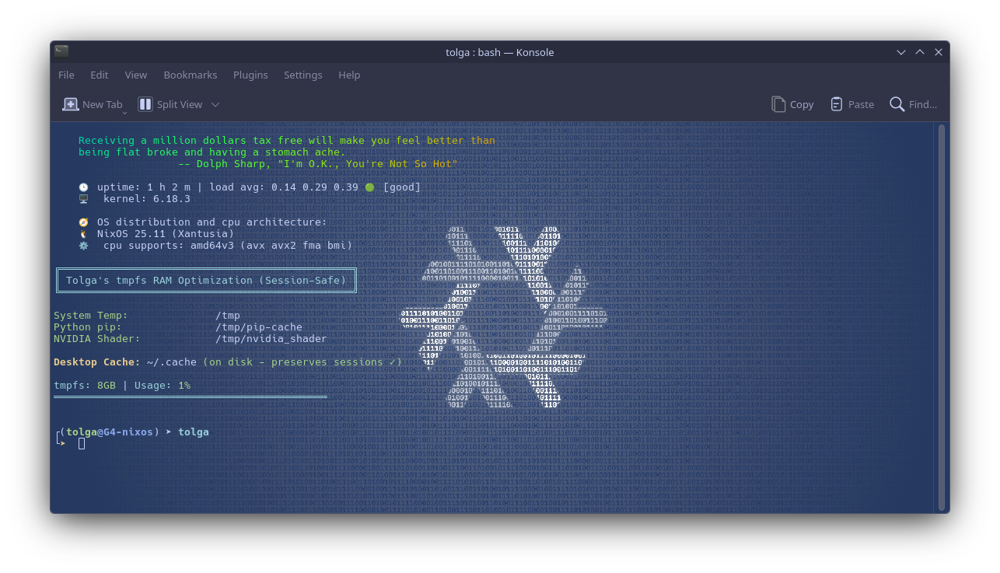
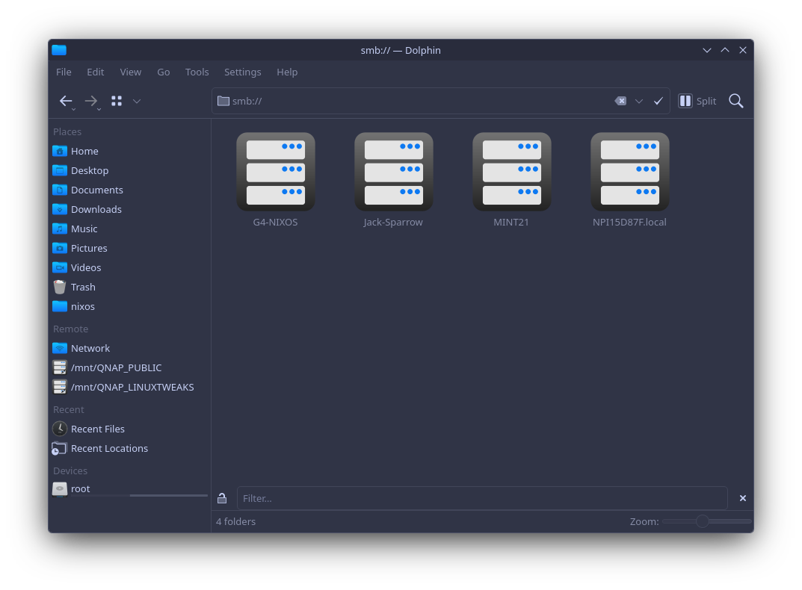

# My NixOs 25.11 KDE & Nvidia






<table style="border-collapse: collapse; width: 100%;">
  <tr>
    <td style="border: none; width: 30%;" valign="top">
      <div align="center">  
          
          <br>  
        </a>
      </div>
    </td>
    <td style="border: none; width: 70%;">
      <table>
        <tr>
          <th align="left">Device</th>
          <th align="left">Specification</th>
        </tr>
        <tr>
          <td>BLUE-TOOTH</td>
          <td>REALTEK 5G</td>
        </tr>
        <tr>
          <td>CPU</td>
          <td>Intel(R) Core(TM) i7-8700 CPU @ 3.20GHz x 12</td>
        </tr>
        <tr>
          <td>GPU</td>
          <td>NVIDIA Corporation TU117 [GeForce GTX 1650] (rev a1)</td>
        </tr>
        <tr>
          <td>MODEL</td>
          <td>HP EliteDesk 800 G4 SFF</td>
        </tr>
        <tr>
          <td>MOTHERBOARD</td>
          <td>Intel® 83E1</td>
        </tr>
        <tr>
          <td>NETWORK</td>
          <td>Intel Corporation Wi-Fi 6E(802.11ax) AX210/AX1675* 2x2 [Typhoon Peak] (rev 1a) 160MHz</td>
        </tr>
        <tr>
          <td>RAM</td>
          <td>32 GB DDR4</td>
        </tr>
        <tr>
          <td>SATA</td>
          <td>SAMSUNG SSD 870 EVO 500GB</td>
        </tr>  
      </table>
    </td>

# Notes:

### Make   /etc/nixos   writable

```bash
sudo chown -R $(whoami):$(id -gn) /etc/nixos
sudo chmod -R 777 /etc/nixos
sudo chmod +x /etc/nixos/*
export NIXPKGS_ALLOW_INSECURE=1
```

### Update NIXOS to 25.11 - Latest Version under unstable (more updates)

```bash
sudo nix-channel --add https://nixos.org/channels/nixpkgs-unstable nixos
sudo nix-channel --update
sudo nixos-rebuild switch --upgrade
```

### Extras

- Install git and some other programs for KDE 6


```bash
nix-env -iA nixos.git                       - 53.18 MiB download, 119.48 MiB unpacked
nix-env -iA nixos.hyfetch                   - 1.80 MiB download, 14.05 MiB unpacked
nix-shell -p kdePackages.plasma-workspace   - 1028.37 MiB download, 2834.11 MiB unpacked
nix-shell -p kdePackages.sddm               - 3.49 MiB download, 5.62 MiB unpacked
nix-shell -p kdePackages.full               - 74.62 MiB download, 232.35 MiB unpacked
nix-env -iA nixos.kdePackages.kwin          - 188.33 MiB download, 195.40 MiB unpacked
```


### You can find many programs here for NIX OS

```bash
https://search.nixos.org/packages?channel=unstable
```

### BOOT SPACE ERROR

If you are out of space on your /boot partition then follow the steps in the section below

- Remove systemd boot, ideally this should be done automatically when systemd-boot is turned off, but 🤷.

```bash
bootctl remove
```

Then:

```bash
sudo rm -rf /boot/loader
```

#### Fix for /boot being out of space

Rebuild but don't switch and store that config

```bash
sudo nixos-rebuild build
```

Run a garbage collection to remove the old system generation

```bash
sudo nix-collect-garbage -d
```

cd into /boot/kernels/

```bash
cd /boot/kernels
```

List the files and then delete any old kernels, DO NOT DELETE NEW ONES, BE VERY CAREFUL
Rebuild and switch

```bash
sudo nixos-rebuild switch
```

Now reboot
